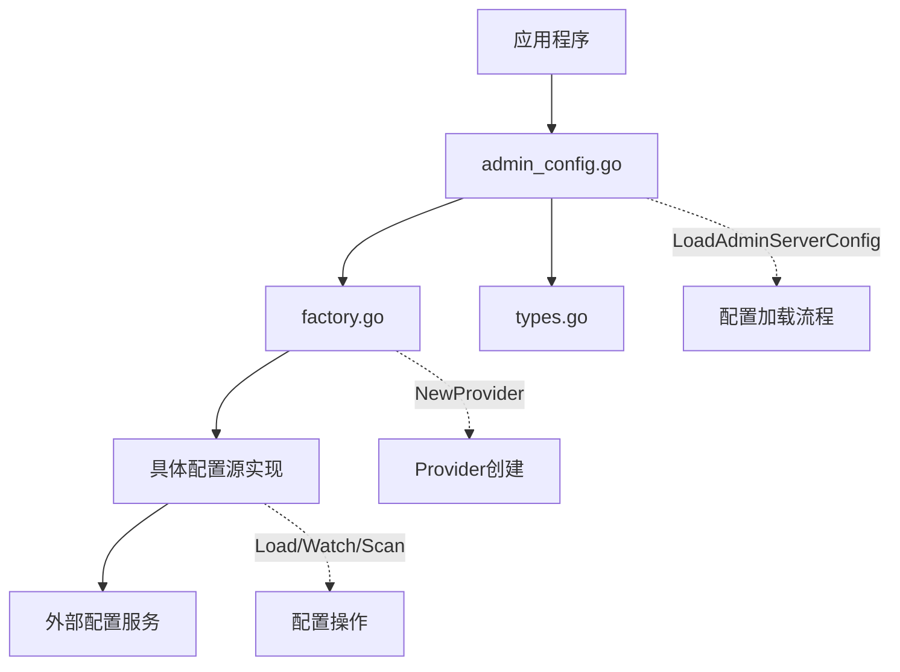

# xkitpkg 配置系统

## 概述

xkitpkg 配置系统是一个灵活、可扩展的配置管理模块，旨在为应用程序提供统一的配置管理解决方案。该系统支持多种配置源，包括本地文件和远程配置服务，并提供动态更新、并发安全的配置访问机制。

## 核心特性

- **多源支持**: 支持本地文件、Apollo、Consul、Etcd、Kubernetes、Nacos、Polaris 等多种配置源
- **动态更新**: 配置热重载，无需重启应用即可生效
- **线程安全**: 并发安全的配置读取和管理机制
- **配置去重**: 自动避免重复配置项的注册
- **工厂模式**: 通过工厂模式轻松扩展新的配置源类型
- **统一接口**: 提供一致的配置访问API
- **协议缓冲**: 基于 Protocol Buffers 定义配置结构，支持强类型验证

## 架构设计

### 核心组件



### 文件结构

| 文件 | 说明 |
|------|------|
| [types.go](file:///D:/GoProjects/chnxq/xkitpkg/config/types.go) | 定义配置源类型常量 |
| [factory.go](file:///D:/GoProjects/chnxq/xkitpkg/config/factory.go) | 实现配置提供者的工厂模式 |
| [admin_config.go](file:///D:/GoProjects/chnxq/xkitpkg/config/admin_config.go) | 管理 AdminServer 配置的加载和访问 |

### 配置源类型

| 类型 | 常量 | 说明 |
|------|------|------|
| Local File | `TypeLocalFile` | 本地文件配置源 |
| Apollo | `TypeApollo` | Apollo 远程配置源 |
| Consul | `TypeConsul` | Consul 远程配置源 |
| Etcd | `TypeEtcd` | Etcd 远程配置源 |
| Kubernetes | `TypeKubernetes` | Kubernetes 配置源 |
| Nacos | `TypeNacos` | Nacos 远程配置源 |
| Polaris | `TypePolaris` | Polaris 远程配置源 |

## API 参考

### 主要函数

- `LoadAdminServerConfig(configPath string)` - 加载程序引导配置
- `GetServerConfig()` - 获取当前 AdminServer 配置
- `RegisterConfig(c proto.Message)` - 注册配置（自动去重）
- `NewFileConfigSource(filePath string)` - 创建本地文件配置源
- `NewProvider(cfg *conf.RemoteConfig)` - 根据配置创建远程配置提供者
- `RegisterFactory(name Type, f Factory)` - 注册配置源工厂
- `MustRegisterFactory(name Type, f Factory)` - 必须注册配置源工厂（失败时 panic）
- `GetFactory(name Type)` - 获取已注册的工厂函数
- `ListFactories()` - 列出所有已注册的工厂

### 配置优先级

配置的优先级从高到低为：
1. 远程配置源（如 Apollo、Consul、Etcd 等）
2. 本地文件配置

高优先级的配置会覆盖低优先级的同名配置项。

## 快速开始

### 1. 基础配置加载

```go
package main

import (
    "log"
    "github.com/chnxq/xkitpkg/config"
)

func main() {
    // 加载配置 - configPath 参数应该是主配置文件的完整路径
    // 系统会从该路径提取目录，并在同目录下查找 remote_config.yaml 文件
    // 如果 remote_config.yaml 存在，则优先使用它作为配置源
    if err := config.LoadAdminServerConfig("./configs/config.yaml"); err != nil {
        log.Fatalf("Failed to load config: %v", err)
    }

    // 获取配置
    adminConfig := config.GetServerConfig()
    
    // 使用配置
    serverConfig := adminConfig.Server
    loggerConfig := adminConfig.Logger
    databaseConfig := adminConfig.Data.Database
    
    // 应用配置...
}
```

### 2. 注册自定义配置

```go
import (
    "github.com/chnxq/xkitpkg/config"
    "github.com/chnxq/xkitpkg/conf/v1"
)

// 自定义配置结构
type MyServiceConfig struct {
    Endpoint string `json:"endpoint"`
    Timeout  string `json:"timeout"`
}

// 注册配置到系统中
func init() {
    // 创建并注册配置实例
    // 这里应该注册实际存在的配置结构，例如服务器配置
    config.RegisterConfig(&conf.Server{})
}
```

### 3. 使用远程配置源

```go
import (
    "github.com/chnxq/xkitpkg/config"
    "github.com/chnxq/xkitpkg/conf/v1"
)

// 自定义配置源工厂函数
func customConfigFactory(cfg *conf.RemoteConfig) (config.Source, error) {
    // 根据远程配置创建具体的配置源实现
    // 例如：连接到自定义配置服务
    // 需要根据实际配置参数实现具体的配置源逻辑
    return &CustomConfigSource{ /* ... */ }, nil
}

// 注册自定义配置源
func init() {
    config.MustRegisterFactory("custom", customConfigFactory)
}
```

## 完整配置文件格式

支持 YAML 格式的配置文件，完整结构如下：

```yaml
# 服务器配置
server:
  rest:
    network: "tcp"
    addr: "0.0.0.0:8080"
    timeout: "30s"
    cors:
      headers:
        - "Content-Type"
        - "Authorization"
        - "X-Requested-With"
      methods:
        - "GET"
        - "POST"
        - "PUT"
        - "DELETE"
        - "OPTIONS"
      origins:
        - "*"
    enable_swagger: true
    enable_pprof: true
  grpc:
    network: "tcp"
    addr: "0.0.0.0:9090"
    timeout: "60s"
  websocket:
    network: "http"
    addr: "0.0.0.0:8081"
    path: "/ws"
    codec: "json"
    timeout: "300s"
  mqtt:
    endpoint: "localhost:1883"
    codec: "json"
    username: ""
    password: ""
    client_id: "xadmin-mqtt-client"
    clean_session: true
  kafka:
    endpoints:
      - "localhost:9092"
    codec: "json"
  rabbitmq:
    endpoints:
      - "localhost:5672"
    codec: "json"
  activemq:
    endpoint: "tcp://localhost:61616"
    codec: "json"
  nats:
    endpoint: "nats://localhost:4222"
    codec: "json"
  nsq:
    endpoint: "localhost:4150"
    codec: "json"
  pulsar:
    endpoint: "pulsar://localhost:6650"
    codec: "json"
  redis:
    endpoint: "localhost:6379"
    codec: "json"
  rocketmq:
    version: "aliyun"
    name_servers:
      - "localhost:9876"
    namespace: "xadmin"
    group_name: "xadmin-group"
    codec: "json"
  asynq:
    network: "tcp"
    endpoint: "localhost:6379"
    db: 0
    pool_size: 10
    codec: "json"
    concurrency: 10
    queues:
      default: 1

# 客户端配置
client:
  rest:
    timeout: "10s"
  grpc:
    timeout: "10s"

# 数据存储配置
data:
  database:
    driver: "mysql"
    source: "root:password@tcp(localhost:3306)/xadmin"
    migrate: true
    debug: false
    enable_trace: true
    enable_metrics: true
    max_idle_connections: 10
    max_open_connections: 100
    connection_max_lifetime: "1h"
  redis:
    network: "tcp"
    addr: "localhost:6379"
    password: ""
    db: 0
    dial_timeout: "5s"
    read_timeout: "3s"
    write_timeout: "3s"
    enable_tracing: true
    enable_metrics: true
  mongodb:
    uri: "mongodb://localhost:27017"
    database: "xadmin"
    connect_timeout: "5s"
    server_selection_timeout: "30s"
    socket_timeout: "30s"
    timeout: "30s"
    enable_tracing: true
    enable_metrics: true
  clickhouse:
    addresses:
      - "localhost:9000"
    database: "xadmin"
    username: "default"
    password: ""
    scheme: "http"
    max_idle_conns: 5
    max_open_conns: 25
    enable_tracing: true
    enable_metrics: true
  influxdb:
    host: "http://localhost:8086"
    token: ""
    organization: "xadmin"
    database: "xadmin"
    write_timeout: "5s"
    query_timeout: "10s"
    idle_connection_timeout: "90s"
    max_idle_connections: 5
  doris:
    address: "localhost:8030"
  elasticsearch:
    addresses:
      - "http://localhost:9200"
    username: ""
    password: ""
    max_retries: 3
    enable_metrics: true
    enable_debug_logger: false
  cassandra:
    address: "localhost:9042"
    username: ""
    password: ""
    keyspace: "xadmin"
    connect_timeout: "5s"
    timeout: "5s"

# 链路追踪配置
trace:
  exporter: "otlp-grpc"
  endpoint: "localhost:4317"
  sampler: 1.0
  env: "dev"
  insecure: true
  enable_trace_context: true
  enable_baggage: true
  batcher_options:
    enabled: true
    max_queue_size: 2048
    max_export_batch_size: 512
    schedule_delay_millis: 5000
    export_timeout_millis: 30000

# 日志配置
logger:
  type: "ZAP"
  zap:
    log_file_path: "./logs/xadmin.log"
    level: "info"
    log_to_console: true
    export_to_otel: false
    max_size: 100
    max_age: 7
    max_backups: 10

# 注册发现配置
registry:
  type: "CONSUL"
  consul:
    scheme: "http"
    address: "localhost:8500"
    health_check: true
  etcd:
    endpoints:
      - "localhost:2379"
  zookeeper:
    endpoints:
      - "localhost:2181"
    timeout: "10s"
  nacos:
    address: "localhost"
    port: 8848
    namespace_id: "public"
    app_name: "xadmin"
    timeout: "5s"
    beat_interval: "5s"
    listen_interval: "30s"

# 远程配置服务
config:
  type: "FILE"
  etcd:
    endpoints:
      - "localhost:2379"
    timeout: "5s"
    key: "xadmin/config"
  consul:
    scheme: "http"
    address: "localhost:8500"
    key: "xadmin/config"
  nacos:
    address: "localhost"
    port: 8848
    username: ""
    password: ""
    namespace_id: "public"
    group: "DEFAULT_GROUP"
    data_id: "xadmin.properties"
    log_level: "info"
    cache_dir: "./cache"
    log_dir: "./logs"
    not_load_cache_at_start: false
    update_cache_when_empty: true
    update_thread_num: 20
    timeout_ms: 5000
    beat_interval: 5000
  apollo:
    endpoint: "http://localhost:8070"
    app_id: "xadmin"
    cluster: "default"
    namespace: "application"
    secret: ""
  kubernetes:
    namespace: "default"
    label_selector: ""
    field_selector: ""
    kube_config: ""
    master: ""
  polaris:
    namespace: "default"
    file_group: "xadmin"
    file_name: "config.yaml"

# 对象存储配置
oss:
  minio:
    endpoint: "localhost:9000"
    access_key: "minioadmin"
    secret_key: "minioadmin"
    token: ""
    use_ssl: false
    upload_host: "localhost:9000"
    download_host: "localhost:9000"

# 通知服务配置
notify:
  sms:
    endpoint: "https://dysmsapi.aliyuncs.com"
    region_id: "cn-hangzhou"
    access_key_id: ""
    access_key_secret: ""

# 认证配置
authn:
  type: "JWT"
  jwt:
    method: "HS256"
    key: "your-secret-key-change-this-immediately"
  oidc:
    issuer_url: ""
    audience: ""
    method: "RS256"
  preshared_key:
    valid_keys:
      - "your-preshared-key"

# 授权配置
authz:
  type: "CASBIN"
  casbin:
    model_path: "conf/rbac_model.conf"
    policy_path: "conf/rbac_policy.csv"
    model: |
      [request_definition]
      r = sub, obj, act
      [policy_definition]
      p = sub, obj, act
      [role_definition]
      g = _, _
      [policy_effect]
      e = some(where (p.eft == allow))
      [matchers]
      m = g(r.sub, p.sub) && r.obj == p.obj && r.act == p.act

# 脚本引擎配置
script:
  engine: 1  # LUA
  lua:
    enabled: true
    paths:
      - "./scripts"
    entry: "main.lua"
    pre_load_scripts:
      - "helper.lua"
    hot_reload: true
    options: {}
  pool:
    initial: 2
    max: 10
```

## 环境变量支持

系统支持通过环境变量覆盖配置文件中的值，环境变量命名格式为：

```
XADMIN_<SECTION>_<KEY>=value
```

其中 `<SECTION>` 和 `<KEY>` 是大写的配置路径段。

示例：
```
# 覆盖数据库驱动
XADMIN_DATA_DATABASE_DRIVER=postgres

# 覆盖 Redis 地址
XADMIN_DATA_REDIS_ADDR=redis-cluster:6379

# 覆盖服务器地址
XADMIN_SERVER_REST_ADDR=0.0.0.0:9090
```

## 扩展开发

### 添加新的配置源

要添加新的配置源类型，需要：

1. 在 [types.go](file:///D:/GoProjects/chnxq/xkitpkg/config/types.go) 中定义新的类型常量
2. 实现 `config.Source` 接口（来自 XGoKit 库）
3. 创建工厂函数
4. 在 `init()` 函数中注册工厂

```go
import (
    "context"
    "github.com/chnxq/XGoKit/config"
    "github.com/chnxq/xkitpkg/conf/v1"
    "github.com/chnxq/xkitpkg/config"
)

// 1. 实现配置源接口
type CustomConfigSource struct {
    ctx context.Context
    // 其他字段...
}

func (c *CustomConfigSource) Load() error {
    // 实现配置加载逻辑，从自定义配置源获取配置数据
    return nil
}

func (c *CustomConfigSource) Watch() (<-chan config.Event, error) {
    // 实现配置变更监听逻辑，返回事件通道
    // 当配置发生变更时，向返回的通道发送事件
    return nil, nil
}

func (c *CustomConfigSource) Scan(v interface{}) error {
    // 实现配置扫描逻辑，将配置数据映射到传入的目标对象
    return nil
}

func (c *CustomConfigSource) Close() error {
    // 实现资源清理逻辑，关闭连接等
    return nil
}

// 2. 创建工厂函数
func NewCustomConfigSource(cfg *conf.RemoteConfig) (config.Source, error) {
    // 解析配置参数并创建实例
    source := &CustomConfigSource{
        ctx: context.Background(),
        // ...
    }
    return source, nil
}

// 3. 注册工厂
func init() {
    config.MustRegisterFactory("custom", NewCustomConfigSource)
}
```

## 最佳实践

1. **配置分层**: 将不同环境的配置分离，使用不同的配置文件或远程配置源
2. **安全配置**: 敏感信息（如密码、密钥）应通过环境变量或安全的远程配置服务提供
3. **配置验证**: 在配置加载后进行必要的验证，确保关键配置项不为空
4. **错误处理**: 妥善处理配置加载失败的情况，提供合理的默认值
5. **文档化**: 为自定义配置项提供清晰的文档说明
6. **配置备份**: 定期备份重要配置文件
7. **权限管理**: 确保配置文件具有适当的访问权限

## 部署建议

- **生产环境**: 确保配置文件具有适当的权限设置，避免敏感信息泄露
- **容器化部署**: 使用环境变量或挂载卷的方式管理配置
- **配置管理工具**: 考虑使用专门的配置管理工具（如 Helm、Kustomize）来管理配置
- **监控告警**: 监控配置加载状态，及时发现配置异常

## 注意事项

- 生产环境中请务必修改默认的敏感配置（如数据库密码、JWT 密钥等）
- 根据实际部署环境调整服务地址和端口配置
- 建议在生产环境中启用 TLS 加密传输
- 合理设置连接池大小和超时时间以优化性能
- 确保远程配置服务的网络连接稳定性
- 定期轮换配置中的密钥和认证凭据
- 验证配置文件格式，避免语法错误导致应用启动失败