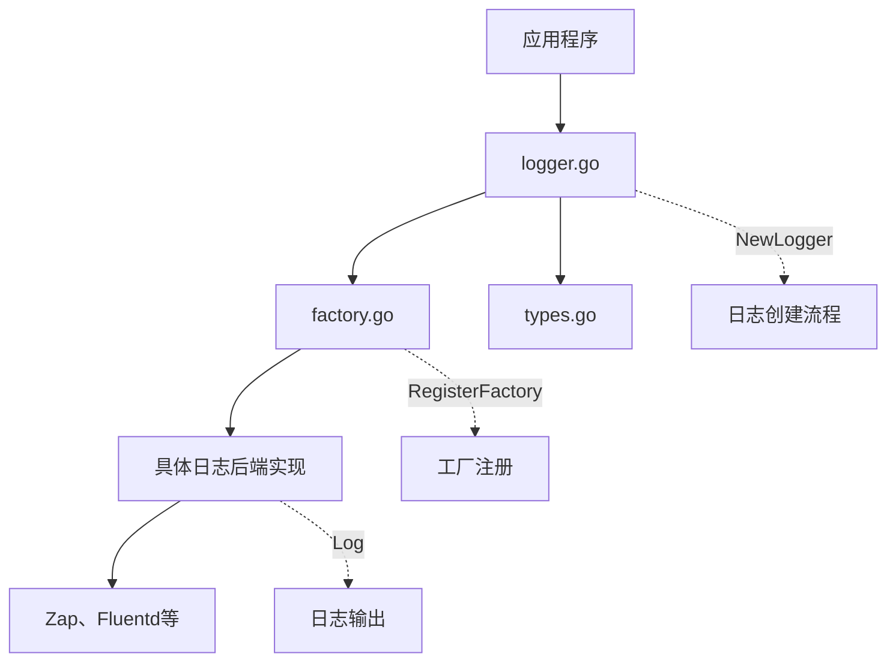

# xkitpkg 日志系统

## 概述

xkitpkg 日志系统是一个灵活、可扩展的日志管理模块，旨在为应用程序提供统一的日志记录解决方案。该系统支持多种日志后端，包括 Zap、Fluentd 等，并提供统一的日志接口。

## 核心特性

- **多后端支持**: 支持多种日志后端，包括 Zap、Fluentd 等
- **结构化日志**: 支持结构化日志输出
- **工厂模式**: 通过工厂模式轻松扩展新的日志后端
- **统一接口**: 提供一致的日志记录API
- **链路追踪集成**: 与分布式链路追踪系统集成

## 架构设计

### 核心组件



### 文件结构

| 文件 | 说明 |
|------|------|
| types.go | 定义日志类型常量 |
| factory.go | 实现日志实例的工厂模式 |
| logger.go | 日志系统的主入口 |
| zap/ | Zap 日志后端实现 |
| fluentd/ | Fluentd 日志后端实现 |

### 日志类型

| 类型 | 常量 | 说明 |
|------|------|------|
| Standard | `STD` | 标准输出日志 |
| Zap | `ZAP` | Uber Zap 日志库 |
| Fluentd | `FLUENTD` | Fluentd 日志后端 |

## API 参考

### 主要函数

- `NewLogger(cfg *conf.Logger)` - 根据配置创建日志实例
- `NewLoggerProvider(cfg *conf.Logger, appInfo *conf.AppInfo)` - 创建带标准字段的日志提供者
- `RegisterFactory(name Type, f Factory)` - 注册日志工厂
- `MustRegisterFactory(name Type, f Factory)` - 必须注册日志工厂（失败时 panic）
- `GetFactory(name Type)` - 获取已注册的工厂函数
- `ListFactories()` - 列出所有已注册的工厂

## 快速开始

### 1. 基础日志创建

```go
package main

import (
    "log"
    
    "github.com/chnxq/xkitpkg/logger"
    "github.com/chnxq/xkitpkg/conf/v1"
)

func main() {
    // 创建日志配置
    loggerConfig := &conf.Logger{
        Type: "zap",  // 使用 Zap 日志后端
        Zap: &conf.Zap{
            Level: "info",
            Development: false,
            DisableCaller: false,
        },
    }
    
    // 创建日志实例
    lg, err := logger.NewLogger(loggerConfig)
    if err != nil {
        log.Fatalf("Failed to create logger: %v", err)
    }
    
    // 使用日志
    lg.Info("Application started")
}
```

### 2. 带应用信息的日志提供者

```go
package main

import (
    "log"
    
    "github.com/chnxq/xkitpkg/logger"
    "github.com/chnxq/xkitpkg/conf/v1"
)

func main() {
    // 创建日志配置
    loggerConfig := &conf.Logger{
        Type: "zap",
    }
    
    // 创建应用信息
    appInfo := &conf.AppInfo{
        Name: "my-app",
        Version: "v1.0.0",
        Environment: "production",
    }
    
    // 创建日志提供者（自动添加服务信息字段）
    lg := logger.NewLoggerProvider(loggerConfig, appInfo)
    
    // 使用日志
    lg.Info("Application initialized")
}
```

## 配置示例

### Zap 日志配置

```yaml
log:
  type: "zap"
  zap:
    level: "info"
    development: false
    disable_caller: false
    encoding: "json"  # 或 "console"
    encoder_config:
      time_key: "timestamp"
      level_key: "level"
      name_key: "logger"
      caller_key: "caller"
      message_key: "msg"
      stacktrace_key: "stacktrace"
      line_ending: ""
      time_encoder: "iso8601"
      level_encoder: "lowercase"
      caller_encoder: "short"
```

### Fluentd 日志配置

```yaml
log:
  type: "fluentd"
  fluentd:
    host: "localhost"
    port: 24224
    network: "tcp"
    timeout: 3
    write_timeout: 3
    buffer_size: 1024
    tag_prefix: "myapp"
```

## 扩展性

通过工厂模式设计，可以轻松扩展支持新的日志后端，只需实现相应的工厂函数并注册即可。

```go
// 自定义日志后端工厂函数
func customLoggerFactory(cfg *conf.Logger) (log.Logger, error) {
    // 实现自定义日志后端逻辑
    return myCustomLogger, nil
}

// 注册自定义日志后端
logger.MustRegisterFactory("custom", customLoggerFactory)
```